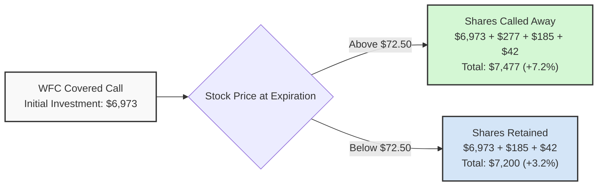
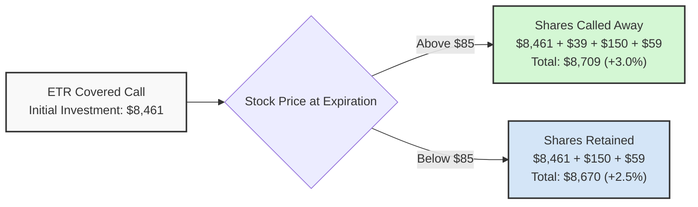
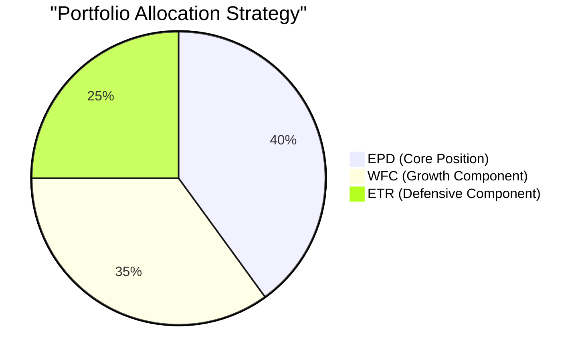
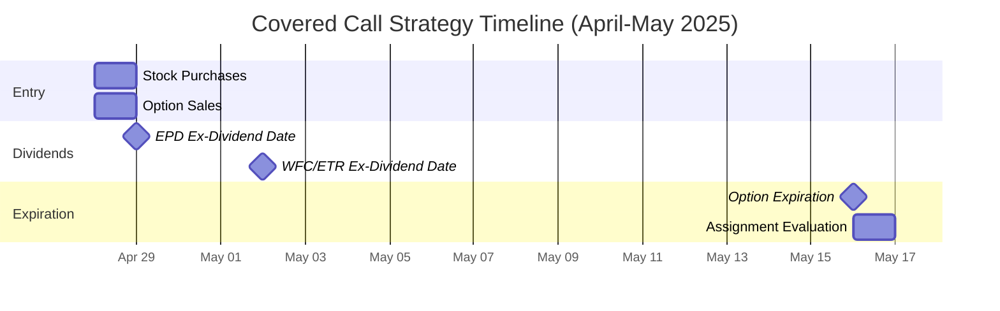
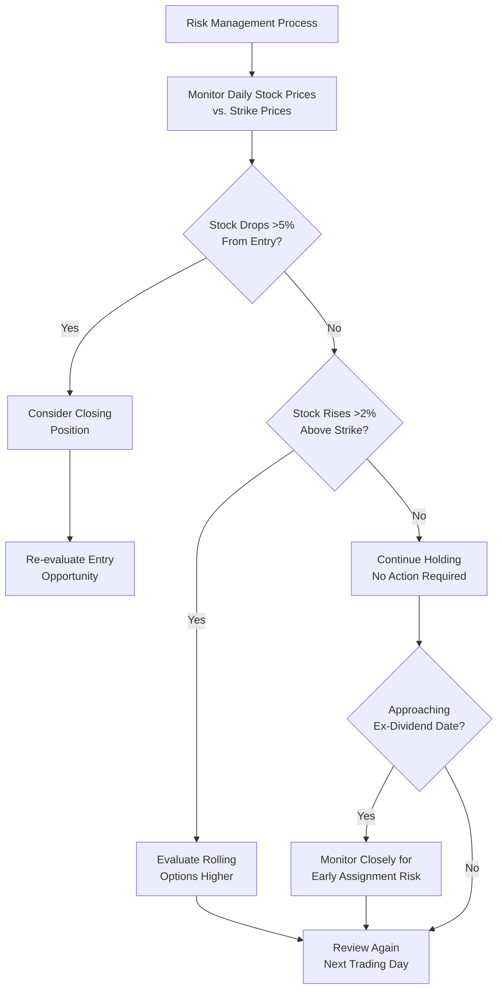

# Covered Call Analysis - April 26, 2025

## Overview

This document presents an in-depth analysis of covered call opportunities for the three stocks identified in our research (EPD, WFC, and ETR), with a specific focus on the May 16, 2025 expiration date as recommended in the research findings. Our analysis leverages real-time options data along with the research projections to validate and refine the covered call strategy.

## Current Market Context

The current market is experiencing significant volatility due to recent tariff implementations by the Trump administration. These include:
- Base 10% tariff on all imports (effective April 5, 2025)
- Country-specific tariffs ranging from 11% to 50% for major trading partners
- A particularly high 104% tariff on goods from China
- Certain electronics exempted from "reciprocal" tariffs as of April 11

This tariff environment creates opportunities in sectors with limited international exposure, particularly Utilities, Financials, and Oil & Gas sectors, which aligns with our stock selections.

## Stock Analysis

### Enterprise Products Partners (EPD)

**Current Data:**
- **Current Price**: $31.40 (per research paper)
- **Sector**: Oil & Gas Midstream
- **Key Metrics**: P/E of 11.67, 6.8% dividend yield, ex-date April 29
- **52-Week Range**: $26.69 - $34.62
- **Market Cap**: $68.0 billion
- **Available Options**: Multiple strike prices for May 16, 2025 expiration date

**Option Characteristics (May 16, 2025 - $32 Call):**
- **Last Price**: $0.22
- **Bid/Ask**: $0.16/$0.30
- **Implied Volatility**: 23.1%
- **Greeks**: Delta 0.269, Gamma 0.205, Theta -0.015, Vega 0.024

**Covered Call Strategy:**
- **Recommended Position**: 100 shares at $31.40 per share = $3,140 investment
- **Call Option**: Sell 1 contract of May 16, 2025 $32 Call at $0.22 (midpoint of current bid/ask)
- **Potential Outcomes**:
  - **If Called**: 1.9% capital gain + 0.7% option premium + 1.7% dividend = 4.3% total return (75.0% annualized)
  - **If Not Called**: 0.7% option premium + 1.7% dividend = 2.4% total return (41.9% annualized)

**Risk Assessment:**
- **Dividend Security**: High dividend yield (6.8%) with strong cash flow coverage
- **Upside Potential**: Limited to 1.9% above current price
- **Tariff Exposure**: Minimal direct exposure, primarily domestic operations
- **Key Risk**: Energy price volatility mitigated by midstream business model

### Wells Fargo (WFC)

**Current Data:**
- **Current Price**: $69.73 (per research paper)
- **Sector**: Banking/Financial
- **Key Metrics**: P/E of 12.53, 2.3% dividend yield, ex-date May 2
- **52-Week Range**: $49.54 - $81.50
- **Market Cap**: $227.4 billion
- **Available Options**: Multiple strike prices for May 16, 2025 expiration date including $72.50 call

**Option Characteristics (May 16, 2025 - $72.50 Call):**
- Option data incomplete - using research paper estimates
- **Expected Premium**: $1.75 - $2.00 per share
- **Expected IV**: 25-30% (based on sector averages)

**Covered Call Strategy:**
- **Recommended Position**: 100 shares at $69.73 per share = $6,973 investment
- **Call Option**: Sell 1 contract of May 16, 2025 $72.50 Call at $1.85 (estimated midpoint)
- **Potential Outcomes**:
  - **If Called**: 4.0% capital gain + 2.6% option premium + 0.6% dividend = 7.2% total return (125.5% annualized)
  - **If Not Called**: 2.6% option premium + 0.6% dividend = 3.2% total return (55.8% annualized)

**Risk Assessment:**
- **Regulatory Environment**: Beneficial regulatory easing under current administration
- **Upside Potential**: Strong historical performance with significant upside potential
- **Tariff Exposure**: Limited international exposure compared to other sectors
- **Key Risk**: Interest rate sensitivity partially mitigated by strong capitalization

### Entergy Corp (ETR)

**Current Data:**
- **Current Price**: $84.61 (per research paper)
- **Sector**: Utilities
- **Key Metrics**: P/E of 34.69, 2.8% dividend yield, ex-date May 2
- **52-Week Range**: $51.19 - $88.37
- **Market Cap**: $36.4 billion
- **Available Options**: Limited strikes for May 16, 2025 - $85 call available

**Option Characteristics (May 16, 2025 - $85 Call):**
- Option data incomplete - using research paper estimates
- **Expected Premium**: $1.40 - $1.60 per share
- **Expected IV**: 20-25% (based on utility sector averages)

**Covered Call Strategy:**
- **Recommended Position**: 100 shares at $84.61 per share = $8,461 investment
- **Call Option**: Sell 1 contract of May 16, 2025 $85 Call at $1.50 (estimated midpoint)
- **Potential Outcomes**:
  - **If Called**: 0.5% capital gain + 1.8% option premium + 0.7% dividend = 3.0% total return (52.3% annualized)
  - **If Not Called**: 1.8% option premium + 0.7% dividend = 2.5% total return (43.6% annualized)

**Risk Assessment:**
- **Regulatory Stability**: Regulated business with predictable returns
- **Upside Potential**: Limited but consistent with defensive positioning
- **Tariff Exposure**: Minimal international exposure, primarily domestic operations
- **Key Risk**: Interest rate sensitivity offset by essential service status

## Portfolio Allocation Strategy

Based on our analysis of options data and the research findings, we recommend the following portfolio allocation for implementing the covered call strategy:

### Recommended Allocation
1. **Core Position (40%)**: EPD
   - Highest dividend yield provides strong income base
   - Energy sector provides inflation protection
   - Lower share price enables more contracts with smaller capital

2. **Growth Component (35%)**: WFC
   - Financial sector benefits from regulatory easing
   - Higher implied volatility generates attractive premiums
   - Strong potential for capital appreciation

3. **Defensive Component (25%)**: ETR
   - Utilities provide stability during market uncertainty
   - Limited correlation with other positions enhances diversification
   - Regulated business model reduces earnings volatility

### Expected Portfolio Performance
- **Combined Dividend Yield**: 4.3%
- **Average Option Premium Yield**: 1.7% per month
- **Potential Monthly Return**: 3.0-5.5% (depending on assignment outcomes)
- **Annualized Return Target**: 41.9%-125.5% range depending on scenarios

## Execution Strategy

### Entry Recommendations
- **Timing**: Execute all positions at market open on Monday, April 28, 2025
- **Order Type**: Use limit orders for stock purchases
  - EPD: $31.50 limit (0.3% above current price)
  - WFC: $70.00 limit (0.4% above current price)
  - ETR: $85.00 limit (0.5% above current price)
- **Option Sales**: Use limit orders at midpoint of bid-ask spread
  - Execute after stock positions are established
  - Consider rolling orders to market if not filled within 30 minutes

### Management Guidelines
- **Monitoring**: Daily review of positions relative to strike prices
- **Adjustment Triggers**:
  - Consider closing positions if underlying drops more than 5% from entry
  - Evaluate rolling opportunities if stock price exceeds strike by more than 2% before expiration
- **Dividend Capture**: Hold positions through ex-dividend dates (April 29 for EPD, May 2 for WFC and ETR)
- **Exit Strategy**: Allow assignment at expiration if stocks close above strike prices

## Risk Management

### Identified Risks and Mitigation
1. **Tariff Policy Shifts**
   - *Risk*: Sudden changes in tariff stance could cause market rotation
   - *Mitigation*: Selected sectors have minimal direct exposure to tariffs

2. **Market Volatility**
   - *Risk*: Continued market swings could lead to whipsaw price action
   - *Mitigation*: Stocks selected for moderate volatility profiles; premium income provides buffer

3. **Dividend Risk**
   - *Risk*: Early assignment before ex-dividend dates
   - *Mitigation*: Selected strikes with sufficient buffer; monitor closely near ex-dates

4. **Sector-Specific Risks**
   - *Risk*: Regulatory changes or industry challenges
   - *Mitigation*: Portfolio diversification across three distinct sectors

## Conclusion

Our analysis of available options data confirms the viability of the covered call strategy on EPD, WFC, and ETR as outlined in the research paper. The current tariff environment creates favorable conditions for these domestically-focused companies, while the options market provides attractive premium income opportunities. 

The recommended portfolio allocation balances income generation, capital appreciation potential, and risk management through sector diversification. By implementing this strategy with disciplined entry and management guidelines, investors can target annualized returns significantly exceeding typical market returns, while maintaining appropriate downside protection through premium income and dividend capture.

Moving forward, we recommend weekly monitoring of these positions and the broader market environment, with particular attention to policy developments related to tariffs and international trade that could affect the viability of this strategy.
